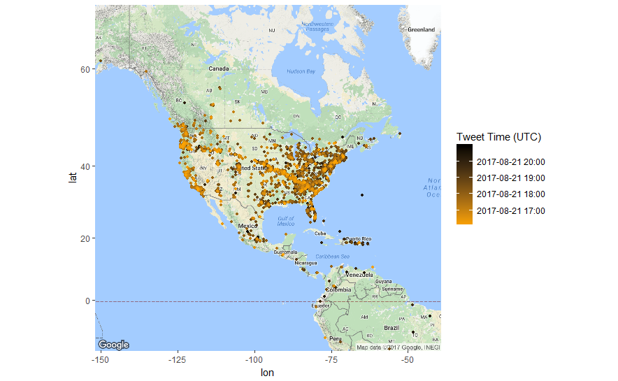

# Eclipse 2017

R script that is used to collect and filter tweets about the 2017 Solar Eclipse 8/21/17 :sun_with_face:

## The Map

This map displays approximately 7,000 location tagged tweets from August 21, 2017 during the hours the solar eclipse was visible across the United States. 

## How to Run
**Prerequisites**: Have R installed, and packages twitteR, dplyr, lubridate, ggmap, and readr (though you don't need readr if you do not intend to write the collected data to a file). To install all these packages, run ```install.packages("twitteR", "dplyr", "lubridate", "ggmap", "readr")``` in your R terminal.

1. Clone this repo to your computer from the desktop client or ```git clone https://github.com/RiRam/Eclipse2017.git``` from a terminal.
1. Create an application on your Twitter account on the [Twitter Application Management page](https://apps.twitter.com/).
1. Create a .r file titled "credentials.r" in the repo folder and assign your access_secret, access_token, consumer_key, and consumer_secret values.
1. Run the setup.r script. From top to bottom: loads libraries, establishes Twitter connection, searches tweets, wrangles them into a format suitable for mapping, generates the map, and writes the collected data to csv.
